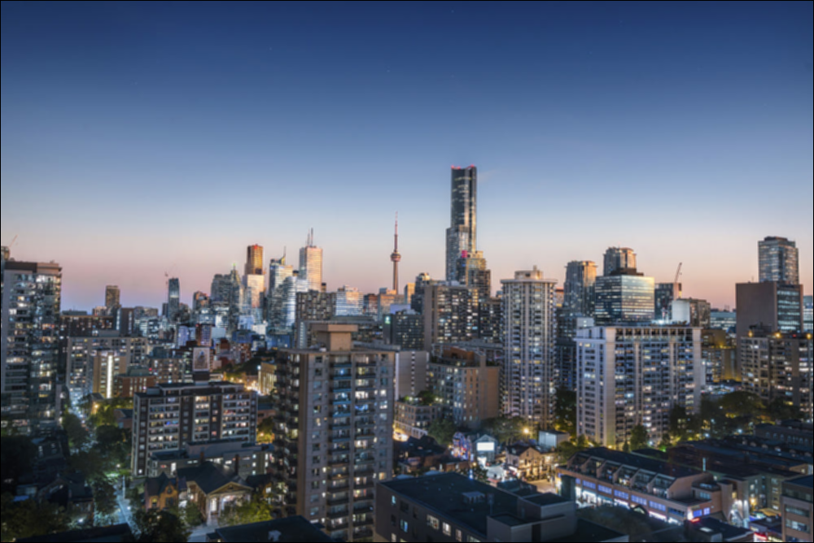

# Image Operations Program
Supports operations on PPM images: negate, brighten, sharpen, smooth, grayscale,
and contrast. The program was written with documentation in mind for ease of
modification and customization.

## Example
*Converted from PPM to PNG format for display*
Before | After
|-------------------------|-------------------------|
| Original | Negated |
|  |  |
| Original | Brightened by 45 |
|  |  |
| Original | Sharpened |
|  |  |
| Original | Smoothed |
|  |  |
| Original | Grayscaled |
|  |  |
| Original | Contrasted |
|  |  |

## Usage
```
C:\> image_operations [option] -o[ab] basename image.ppm
   -n - negate
   -b - brighten
   -p - sharpen
   -s - smooth
   -g - grayscale
   -c - contrast
```
